### 决策树

### 概述  
决策树（Decision Tree）算法是一类常见的机器学习算法。决策树模型呈树形结构，在分类问题中，表示基于特征对实例进行分类的过程。它可以认为是 if-then 规则的集合，也可以认为是定义在特征空间与类空间上的条件概率分布。  
决策树学习通常包括 3 个步骤：特征选择、决策树的生成和决策树的修剪。  
<!--more-->

### 数据集
我们使用《机器学习》一书中的西瓜数据集和《机器学习实战》中的隐形眼镜数据集作为我们的数据集。  
西瓜数据集2.0 (watermelon2.0.txt) 无连续属性，无缺失值:  
```txt
青绿,蜷缩,浊响,清晰,凹陷,硬滑,是  
乌黑,蜷缩,沉闷,清晰,凹陷,硬滑,是  
乌黑,蜷缩,浊响,清晰,凹陷,硬滑,是  
青绿,蜷缩,沉闷,清晰,凹陷,硬滑,是  
浅白,蜷缩,浊响,清晰,凹陷,硬滑,是  
青绿,稍蜷,浊响,清晰,稍凹,软粘,是  
乌黑,稍蜷,浊响,稍糊,稍凹,软粘,是  
乌黑,稍蜷,浊响,清晰,稍凹,硬滑,是  
乌黑,稍蜷,沉闷,稍糊,稍凹,硬滑,否  
青绿,硬挺,清脆,清晰,平坦,软粘,否  
浅白,硬挺,清脆,模糊,平坦,硬滑,否  
浅白,蜷缩,浊响,模糊,平坦,软粘,否  
青绿,稍蜷,浊响,稍糊,凹陷,硬滑,否  
浅白,稍蜷,沉闷,稍糊,凹陷,硬滑,否  
乌黑,稍蜷,浊响,清晰,稍凹,软粘,否  
浅白,蜷缩,浊响,模糊,平坦,硬滑,否  
青绿,蜷缩,沉闷,稍糊,稍凹,硬滑,否  
```
隐形眼镜数据集 (lenses.txt)：
```txt
1  1  1  1  3
1  1  1  2  2
1  1  2  1  3
1  1  2  2  1
1  2  1  1  3
1  2  1  2  2
1  2  2  1  3
1  2  2  2  1
2  1  1  1  3
2  1  1  2  2
2  1  2  1  3
2  1  2  2  1
2  2  1  1  3
2  2  1  2  2
2  2  2  1  3
2  2  2  2  3
3  1  1  1  3
3  1  1  2  3
3  1  2  1  3
3  1  2  2  1
3  2  1  1  3
3  2  1  2  2
3  2  2  1  3
3  2  2  2  3
```  
### 定义 
决策树的定义：  
分类决策树模型是一种描述对实例进行分类的树形结构。决策树由结点（node）和有向边（directed edge）组成。结点有两种类型：内部结点（internal node）和叶结点（leaf node）。内部结点表示一个特征或属性(features)，叶结点表示一个类(labels)。  

用决策树对需要测试的实例进行分类：从根节点开始，对实例的某一特征进行测试，根据测试结果，将实例分配到其子结点；这时，每一个子结点对应着该特征的一个取值。如此递归地对实例进行测试并分配，直至达到叶结点。最后将实例分配到叶结点的类中。  

决策树的伪代码见西瓜书P74。


### 选择最优划分属性  
 
从上面的介绍中可以看出，关键在于如何最优划分属性，一般的，随着划分过程的不断进行，我们希望决策树的分支结点所包含的样本尽可能属于同一类别，即结点的纯度越来越高。所以我们有了下面的关于如何选择最优划分属性的各种定义：   
#### 信息熵 
信息熵(information)是度量样本集合纯度常用的一种指标。假定当前样本集合D中第k类样本所占比例为pk,则D的信息熵定义如下： 

$$Ent(D)=\sum_{k=1}^{|γ|}p_klog_2p_k$$ 

```python
#计算信息熵
def calEnt(dataSet):
    numEntries = len(dataSet)
    labelCounts = {}
    for featVec in dataSet:
        currentLabel = featVec[-1]
        if currentLabel not in labelCounts.keys():
            labelCounts[currentLabel] = 0
        labelCounts[currentLabel] += 1
    Ent = 0.0 
    for key in labelCounts:
        if labelCounts[key] == 0:
            p_current = 0
        else:
            p_current = float(labelCounts[key])/numEntries
        Ent += -p_current*log(p_current,2) 
    return Ent
```
#### 信息增益 
信息增益(information gain)： 在划分数据集前后信息发生的变化称为信息增益。假定离散属性a有V个可能的取值，若使用a来对样本集合D进行划分，则会产生V个分支结点，其中第v个分支结点包含了D中所有在属性a上取值为av的样本，记为Dv。于是用属性a对样本集D进行划分所获得的信息增益如下：  
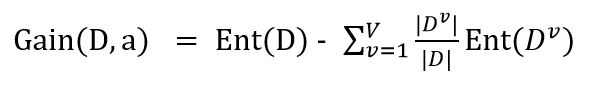  
```python
#计算信息增益
def calGain(dataSet, feature, baseEnt):
    featList = [example[feature] for example in dataSet]
    uniqueVals = set(featList)
    newEntropy = 0.0
    for value in uniqueVals:
        subDataSet = splitDataSet(dataSet, feature, value)
        p_current = float(len(subDataSet)/len(dataSet))
        newEntropy += p_current*calEnt(subDataSet)
    Gain = baseEnt - newEntropy
    return Gain
```
feature即所计算的特征的index，baseEnt就是Ent(D)，因为计算每个属性的信息增益都需要这个，为了避免重复计算，就作为输入了。
#### 信息增益率
引文实际情况中信息增益准则对可取值数目较多的属性有所偏好，为减少这种偏好带来的不利影响，可以使用信息增益率(gain ratio)来选择最优划分属性。  
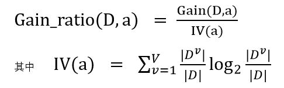  
IV(a)称为属性a的固有值(instrinsic value)。属性a的可能取值数目越多(即V越大)，则IV(a)的值通常会越大。  
问题又来了，信息增益率又会对可取值数目较少的属性有所偏好，因此著名的C4.5算法使用了一个启发式：先从候选划分属性中找出信息增益高于平均水平的属性，在从中选择增益率最高的。这里不做深入探讨。  
```python
def calGainRatio(dataSet, feature, baseEnt):
    featList = [example[feature] for example in dataSet]
    uniqueVals = set(featList)
    IV = 0.0
    for value in uniqueVals:
        subDataSet = splitDataSet(dataSet, feature, value)
        p_current = float(len(subDataSet)/len(dataSet))
        IV += -p_current*log(p_current, 2)
    Gain = calGain(dataSet, feature, baseEnt)/IV
    return Gain
```
#### 基尼指数 
上面都以信息熵为基础，也可以使用其他指标来度量，比如基尼指数(Gini index)。数据集D的纯度可以用基尼值来度量：  
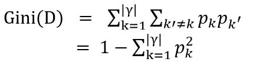  
```python
#计算基尼值
def calGini(dataSet):
    numEntries = len(dataSet)
    labelCounts = {}
    Gini = 0
    for featVec in dataSet:
        currentLabel = featVec[-1]
        if currentLabel not in labelCounts.keys():
            labelCounts[currentLabel] = 0
        labelCounts[currentLabel] += 1
    pList = [0 if labelCounts[key]==0 else float(labelCounts[key])/numEntries \
                for key in labelCounts]
    #获得p的两两组合的list
    comList = itertools.combinations(pList,2)
    for item in comList:
        Gini += item[0]*item[1]
    return Gini
```
直观来说，Gini(D反映了从数据集D中随机抽取两个样本，其类别标记不一致的概率。因此Gini(D)越小，则数据集D的纯度越高。
属性a 的基尼指数定义为：  
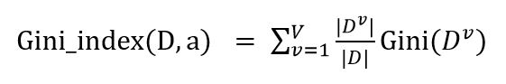  
```python
#计算基尼指数
def calGiniIndex(dataSet, feature):
    featList = [example[feature] for example in dataSet]
    uniqueVals = set(featList)
    GiniIndex = 0.0
    for value in uniqueVals:
        subDataSet = splitDataSet(dataSet, feature, value)
        p_current = float(len(subDataSet)/len(dataSet))
        GiniIndex += p_current*calGini(subDataSet)
    return GiniIndex 
```
### 实现
除了上面的计算各个指数的代码之外，我们还需要添加一些别的函数。  
#### 划分数据集
axis是按照哪个属性划分，value，是指该属性上的取值，举个例子，西瓜数据集，axis=色泽的index，value=“青绿”，则该函数返回dataSet中所有色泽=青绿的西瓜构成的子集。
```python
#划分数据集
def splitDataSet(dataSet, axis, value):
    retDataSet = []
    for featVec in dataSet:
        if featVec[axis] == value:
            reducedFeatVec = featVec[:axis]
            reducedFeatVec.extend(featVec[axis+1:])
            retDataSet.append(reducedFeatVec)
    return retDataSet
```
#### 选择特征
根据不同的度量方法，有不同的选择方法，其中Gain和GainRatio都是选择最大值，GiniIndex选择最小值
```python
#根据信息增益选择最好的特征
def chooseBestFeatureByGain(dataSet):
    numFeatures = len(dataSet[0])-1
    baseEnt = calEnt(dataSet)
    bestGain = 0.0 
    bestFeature = -1
    for i in range(numFeatures):
        Gain = calGain(dataSet, i, baseEnt)
        if Gain > bestGain:
            bestGain = Gain
            bestFeature = i
    return bestFeature

#根据信息增益率选择最好的特征
def chooseBestFeatureByGainRatio(dataSet):
    numFeatures = len(dataSet[0])-1
    baseEnt = calEnt(dataSet)
    bestGainRatio = 0.0 
    bestFeature = -1
    for i in range(numFeatures):
        GainRatio = calGainRatio(dataSet, i, baseEnt)
        if GainRatio > bestGainRatio:
            bestGainRatio = GainRatio
            bestFeature = i
    return bestFeature

#根据基尼指数选择最好的特征
def chooseBestFeatureByGiniIndex(dataSet):
    numFeatures = len(dataSet[0])-1
    bestGiniIndex = calGiniIndex(dataSet, 0) 
    bestFeature = -1
    for i in range(1,numFeatures):
        GiniIndex = calGiniIndex(dataSet, i)
        if GiniIndex < bestGiniIndex:
            bestGiniIndex = GiniIndex
            bestFeature = i
    return bestFeature
```
#### 计算出现次数最多的分类
```python
#计算出现次数最多的分类名称
def majorityCnt(classList):
    classCount = {}
    for vote in classList:
        if vote not in classCount.keys():
            classCount[vote] = 0
        classCount[vote] += 1
    sortedClassCount = sorted(classCount.items(), \
                        key=operator.itemgetter(1), reverse=True)
    return sortedClassCount[0][0]
```
#### 构造树
注释中解释了《机器学习实战》中出现的错误。
```python
#建立树
def createTree(dataSet, labels, divide_by="gain"):
    classList = [example[-1] for example in dataSet]
    # 如果数据集的最后一列的第一个值出现的次数=整个集合的数量，
    # 也就说只有一个类别，就只直接返回结果就行
    # 第一个停止条件：所有的类标签完全相同，则直接返回该类标签。
    if classList.count(classList[0]) == len(classList):
        return classList[0]
    # 如果数据集只有1列，那么最初出现label次数最多的一类，作为结果
    # 第二个停止条件：使用完了所有特征，仍然不能将数据集划分成仅包
    # 含唯一类别的分组。
    if len(dataSet[0]) == 1:
        return majorityCnt(classList)
    # 选择划分特征依据
    divide_func = {"gain":chooseBestFeatureByGain, 
                "gainRatio":chooseBestFeatureByGainRatio,
                "giniIndex":chooseBestFeatureByGiniIndex}
    bestFeat = divide_func[divide_by](dataSet)
    bestFeatLabel = labels[bestFeat]
    myTree = {bestFeatLabel:{}}

    #书上原句有错
    #原句：del(labels[bestFeat])
    #这样会修改labels，后面运行会报'no surfacing' is not in list错误
    #修改如下：
    subLabels = labels[:]
    del(subLabels[bestFeat])
    featValues = [example[bestFeat] for example in dataSet]
    uniqueVals = set(featValues)
    for value in uniqueVals:
        myTree[bestFeatLabel][value] = createTree(splitDataSet\
                                        (dataSet, bestFeat, value), \
                                        subLabels,divide_by)
    return myTree
```
#### 分类器
构造树后我们就要用这个树来对未知数据进行分类。inputTree就是上面得到的树，featLabels为标签向量，如watermelonLabels=['色泽', '根蒂', '敲声', '纹理', '脐部', '触感']，testVec为测试向量，如["青绿","蜷缩","浊响","清晰","凹陷","硬滑"].
```python
#分类器 
def classify(inputTree, featLabels, testVec):
    firstStr = list(inputTree.keys())[0]        
    secondDict = inputTree[firstStr]
    featIndex = featLabels.index(firstStr)
    for key in secondDict.keys():
        if testVec[featIndex] == key:
            if type(secondDict[key]) == dict:
                classLabel = classify(secondDict[key], featLabels, testVec)
            else:
                classLabel = secondDict[key]
    return classLabel
```
#### 持久化
得到分类器后可以持久化保存起来，下次使用时就不需要再训练一个分类器了，直接读取即可。
```python
#存储树
def storeTree(inputTree, filename):
    import pickle
    fw = open(filename, 'w')
    pickle.dump(inputTree, fw)
    fw.close()

#读取树
def grabTree(filename):
    import pickle
    fr = open(filename)
    return pickle.load(fr)
```
demo
```python
decision_tree.storeTree(inputTree, './storage.txt')
decision_tree.grabTree('./storage.txt')
```
#### 可视化
得到的树是一个Python的字典，不容易理解，我们可以将这个树画出来帮助我们看清楚结果。由于这部分不是决策树的重点内容，又涉及到matplotlib的使用，所以不作详述。  
treePlotter.py:  
```python
#-*- coding=utf-8 -*-
import matplotlib.pyplot as plt

plt.rcParams['font.sans-serif']=['SimHei'] #用来正常显示中文标签
plt.rcParams['axes.unicode_minus']=False #用来正常显示负号


decisionNode = dict(boxstyle="sawtooth", fc="0.8")
leafNode = dict(boxstyle="round4", fc="0.8")
arrow_args = dict(arrowstyle="<-")

#绘制结点
def plotNode(nodeTxt, centerPt, parentPt, nodeType):
    createPlot.ax1.annotate(nodeTxt, xy=parentPt,\
    xycoords='axes fraction',
    xytext = centerPt,
    textcoords='axes fraction',
    va="center",ha="center",bbox=nodeType,
    arrowprops=arrow_args)

#计算叶子结点数
def getNumLeafs(myTree):
    numLeafs = 0
    firstStr = list(myTree.keys())[0]
    secondDict = myTree[firstStr]
    for key in secondDict.keys():
        if type(secondDict[key]) == dict:
            numLeafs += getNumLeafs(secondDict[key])
        else:
            numLeafs += 1
    return numLeafs

#计算树的深度
def getTreeDepth(myTree):
    maxDepth = 0
    firstStr = list(myTree.keys())[0]
    secondDict = myTree[firstStr]
    for key in secondDict.keys():
        if type(secondDict[key]) == dict:
            thisDepth = 1 + getTreeDepth(secondDict[key])
        else:
            thisDepth = 1
        if thisDepth > maxDepth:
            maxDepth = thisDepth
    return maxDepth

#绘制标签文字
def plotMidText(cntrPt, parentPt, txtString):
    xMid = (parentPt[0]-cntrPt[0])/2.0 + cntrPt[0]
    yMid = (parentPt[1]-cntrPt[1])/2.0 + cntrPt[1]    
    createPlot.ax1.text(xMid, yMid, txtString)

#绘制树
def plotTree(myTree, parentPt, nodeTxt):
    numLeafs = getNumLeafs(myTree)
    firstStr = list(myTree.keys())[0]
    cntrPt = (plotTree.xOff + (1.0 + float(numLeafs))/2.0/plotTree.totalW,
                plotTree.yOff)
    plotMidText(cntrPt, parentPt, nodeTxt)
    plotNode(firstStr, cntrPt, parentPt, decisionNode)
    secondDict = myTree[firstStr]
    plotTree.yOff = plotTree.yOff - 1.0/plotTree.totalD
    for key in secondDict.keys():
        if type(secondDict[key])== dict:
            plotTree(secondDict[key], cntrPt, str(key))
        else:
            plotTree.xOff = plotTree.xOff + 1.0/plotTree.totalW
            plotNode(secondDict[key], (plotTree.xOff, plotTree.yOff),
            cntrPt, leafNode)
            plotMidText((plotTree.xOff, plotTree.yOff), cntrPt, str(key))
    plotTree.yOff = plotTree.yOff + 1.0/plotTree.totalD

#开始绘画
def createPlot(inTree):
    fig = plt.figure(1, facecolor='white')
    fig.clf()
    axprops = dict(xticks=[], yticks=[])
    createPlot.ax1 = plt.subplot(111, frameon=False, **axprops)
    plotTree.totalW = float(getNumLeafs(inTree))
    plotTree.totalD = float(getTreeDepth(inTree))
    plotTree.xOff = -0.5/plotTree.totalW
    plotTree.yOff = 1.0
    plotTree(inTree, (0.5,1.0), '')
    plt.show()
```

#### 测试
下面进行一些测试。  
西瓜数据集2.0:  
```python
import decision_tree
import treePlotter
#西瓜数据集2.0
fr=open('./watermelon2.0.txt','r',encoding = 'utf8')
watermelon=[inst.strip().split(',') for inst in fr.readlines()]
watermelonLabels=['色泽', '根蒂', '敲声', '纹理', '脐部', 
            '触感']
watermelonTree = decision_tree.createTree(watermelon, watermelonLabels,divide_by="gainRatio")
treePlotter.createPlot(watermelonTree)
```
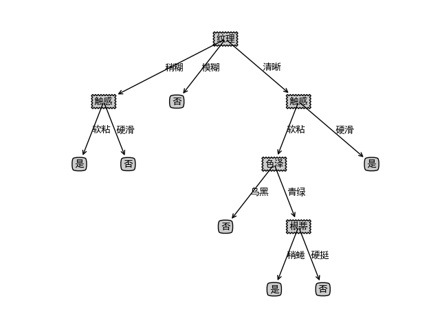  
隐形眼镜数据集:  
```python
import decision_tree
import treePlotter
#隐形眼镜数据集
fr=open('./lenses.txt')
lenses=[inst.strip().split('  ') for inst in fr.readlines()]
lensesLabels=['age','prescript','astigmatic','tearRate']
lensesTree = decision_tree.createTree(lenses, lensesLabels)
treePlotter.createPlot(lensesTree)
```
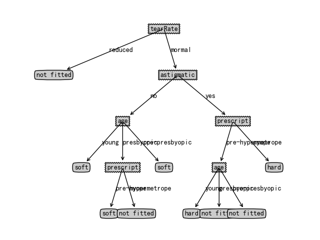  

### 剪枝处理  
决策树的一个缺点是容易过拟合，所以可以通过主动去掉一些分支来降低过拟合的风险。主要有预剪枝和后剪枝两种策略。预剪枝是指在决策树生成过程中，对每个结点在划分前进行估计，若当前结点的划分不能带来决策树泛化性能提升，则停止划分并将该结点标记为叶结点。后剪枝则是先从训练集生成一棵完整的决策树，然后自底向上地对非叶结点进行考察，若将该结点对应的子树替换为叶结点能带来泛化能力的提升，则将该子树替换为叶结点。
如何判断决策树的泛化能力是否提升呢？我们假定使用流出法，即预留出一部分数据用作“验证集”进行性能评估。  
#### 预剪枝 

#### 后剪枝 

### 连续和缺失值处理
#### 连续值处理
目前为止，我们的属性都是离散的，当遇到连续属性时，我们需要进行离散化，最简单的方法就是二分法。  
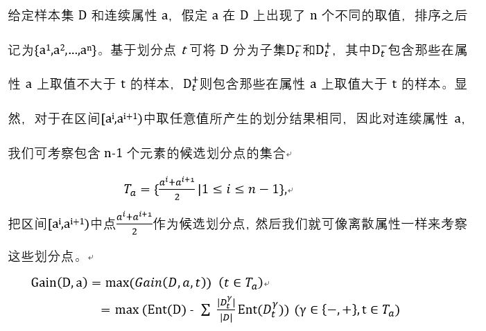  
我们需要修改我们的代码来使其能处理连续的属性。  
首先需要根据划分点划分集合：
```python
#对连续变量划分数据集  
#划分出小于value的数据样本和大于value的数据样本集  
def splitContinuousDataSet(dataSet,axis,value):  
    retDataSetLeft=[]  
    retDataSetRight=[] 
    for featVec in dataSet:  
        reducedFeatVec=featVec[:axis]  
        reducedFeatVec.extend(featVec[axis+1:])  
        if float(featVec[axis])>value:  
            retDataSetRight.append(reducedFeatVec)  
        else:
            retDataSetLeft.append(reducedFeatVec)  
    return retDataSetLeft, retDataSetRight
```
接下来修改chooseBestFeature()函数，这里我们使用信息增益准则：  
```python
#对连续变量划分数据集  
#划分出小于value的数据样本和大于value的数据样本集  
def chooseBestFeatureToSplit(dataSet,labels):  
    numFeatures=len(dataSet[0])-1  
    baseEntropy=calEnt(dataSet)  
    bestInfoGain=0.0  
    bestFeature=-1  
    bestSplitDict={}  
    for i in range(numFeatures):  
        featList=[example[i] for example in dataSet]  
        #对连续型特征进行处理  
        if isContinuity(featList[0]):  
            #产生n-1个候选划分点  
            sortfeatList=sorted(list(map(float,featList)))  
            splitList=[]  
            for j in range(len(sortfeatList)-1):  
                splitList.append((sortfeatList[j]+sortfeatList[j+1])/2.0)  
              
            bestSplitEntropy=10000  
            slen=len(splitList)  
            #求用第j个候选划分点划分时，得到的信息熵，并记录最佳划分点  
            for j in range(slen):  
                value=splitList[j]  
                newEntropy=0.0  
                subDataSetLeft, subDataSetRight=splitContinuousDataSet(dataSet,i,value)  
                prob0=len(subDataSetLeft)/float(len(dataSet))  
                newEntropy+=prob0*calEnt(subDataSetLeft)  
                prob1=len(subDataSetRight)/float(len(dataSet))  
                newEntropy+=prob1*calEnt(subDataSetRight)  
                if newEntropy<bestSplitEntropy:  
                    bestSplitEntropy=newEntropy  
                    bestSplit=j  
            #用字典记录当前特征的最佳划分点  
            bestSplitDict[labels[i]]=splitList[bestSplit]  
            infoGain=baseEntropy-bestSplitEntropy  
        #对离散型特征进行处理  
        else:  
            uniqueVals=set(featList)  
            newEntropy=0.0  
            #计算该特征下每种划分的信息熵  
            for value in uniqueVals:  
                subDataSet=splitDataSet(dataSet,i,value)  
                prob=len(subDataSet)/float(len(dataSet))  
                newEntropy+=prob*calEnt(subDataSet)  
            infoGain=baseEntropy-newEntropy  
        if infoGain>bestInfoGain:  
            bestInfoGain=infoGain  
            bestFeature=i  
    #若当前节点的最佳划分特征为连续特征，则将其以之前记录的划分点为界进行二值化处理  
    #即是否小于等于bestSplitValue  
    if isContinuity(dataSet[0][bestFeature]):        
        bestSplitValue=bestSplitDict[labels[bestFeature]]          
        labels[bestFeature]=labels[bestFeature]+'<='+str(bestSplitValue)  
        for i in range(len(dataSet)):  
            if float(dataSet[i][bestFeature])<=float(bestSplitValue):  
                dataSet[i][bestFeature]='是'
            else:  
                dataSet[i][bestFeature]='否'  
    return bestFeature  
```
demo:
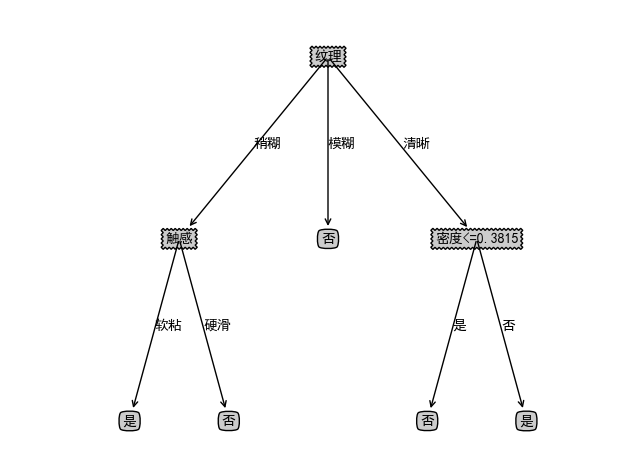 
#### 缺失值处理
我们简单的想会有两种方法，一种是直接放弃有缺失值的样本，但这样有可能会损失大量样本，另一种方法是使用有缺失属性值的样本来学习，由于时间和版面限制，不在这里详细介绍，有需要的可以看西瓜书4.4.2。  

### 最后
#### 三种度量方法的偏好？
限于知识和版面，我们不做数学上严密的论证，既然有了代码，不妨测试一下看看结果：  
信息增益准则：  
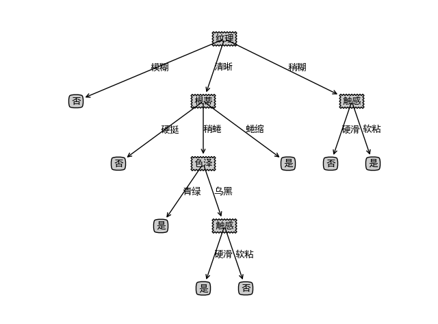   
信息增益率准则：  
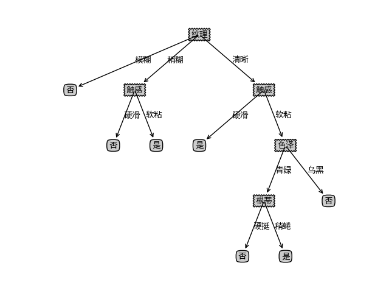 
基尼指数准则：  
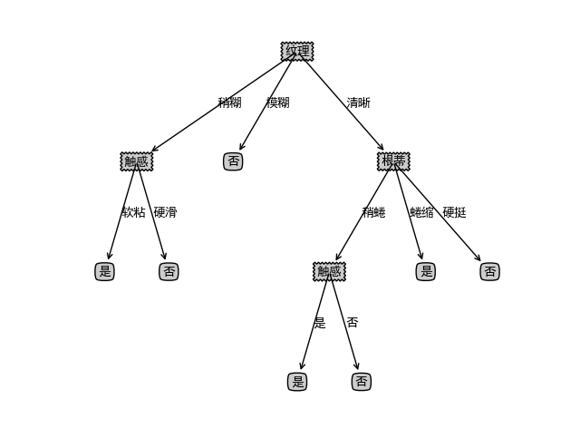 
我们看到，在最优划分属性的选择上，他们确实是不同的，值得注意的是，在纹理=清晰这颗子树上，信息增益准则选择了属性根蒂（有三个取值），而信息增益率选择了属性触感（有两个取值），这个结果或多或少验证了我们之前所说的信息增益会对可取值数目较多的属性有所偏好，而信息增益率会对可取值数目较少的属性有所偏好。

<script type="text/javascript" async src="https://cdn.mathjax.org/mathjax/latest/MathJax.js?config=TeX-MML-AM_CHTML"> </script>